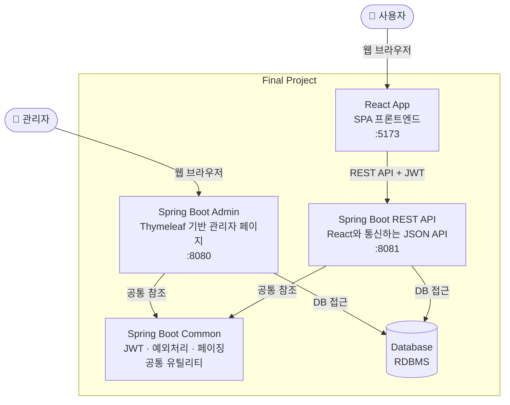

# Final Project - Backend

## 1. 프로젝트 구조

```text
backend
├── admin (관리자 모듈, 타임리프 + 스프링)
├── common (공통 모듈)
└── rest (REST API 모듈, React와 통신)
```

### 1-1. 요청/응답 구조



## 2. 프로젝트 실행

- 관리자 페이지 개발 시 admin 모듈을 실행

  ```bash
   cd admin
   ./mvnw spring-boot:run
  ```

- REST API 개발 시 rest 모듈을 실행

  ```bash
  cd rest
  ./mvnw spring-boot:run
  ```

- 공통 모듈( common )은 admin과 rest에서 모두 참조하므로, 별도의 실행이 필요하지 않음

## 3. 접근 주소

- 관리자 페이지: `http://localhost:8080`
- REST API: `http://localhost:8081`

## 4. 환경 변수 설정

> [!IMPORTANT]
>
> `.env.example` 파일을 복사하여 `.env` 파일을 생성한 후, 필요한 환경 변수를 설정합니다.
>
> ```bash
> # .env
>
> db_host=192.168.0.1
> db_username=foo
> db_password=bar
> ```

## 5. 페이징 처리

[common/src/main/java/kr/or/ddit/finalProject/paging/PaginationInfo.java](common/src/main/java/kr/or/ddit/finalProject/paging/PaginationInfo.java)

위의 클래스는 페이징 처리를 위한 정보를 담고 있습니다.

아래와 같이 두개의 생성자가 제공되며, 첫 번째 생성자는 기본적인 페이징 정보만을 설정하는 반면, 두 번째 생성자는 정렬 기준과 방향까지 포함하여 설정할 수 있습니다.

정렬과 관련된 필드인 `orderBy`와 `orderDirection`은 예를 들어, 회원 목록을 반환할 때 `mem_id`를 기준으로 오름차순으로 정렬하려면, `orderBy`에 "mem_id"를, `orderDirection`에 "ASC"를 설정하면 됩니다.

### 5-1. PaginationInfo 클래스의 생성자 예시

```java
/**
 * PaginationInfo 객체를 생성하는 생성자
 *
 * @param screenSize 한 페이지에 보여줄 데이터 수
 * @param blockSize  한 번에 보여줄 페이지 번호 수
 * @param page       현재 페이지 번호
 */
public PaginationInfo(int screenSize, int blockSize, int page) {
    this.screenSize = screenSize;
    this.blockSize = blockSize;
    this.page = page;
}

/**
 * PaginationInfo 객체를 생성하는 생성자 (정렬 기준과 방향을 포함)
 *
 * @param screenSize     한 페이지에 보여줄 데이터 수
 * @param blockSize      한 번에 보여줄 페이지 번호 수
 * @param page           현재 페이지 번호
 * @param orderBy        정렬 기준 컬럼명 (ex: mem_id, mem_name 등.. mapper에서 if 문으로 사용됨)
 * @param orderDirection 정렬 방향 (ASC(오름차순), DESC(내림차순))
 */
public PaginationInfo(int screenSize, int blockSize, int page, String orderBy, String orderDirection) {
    this.screenSize = screenSize;
    this.blockSize = blockSize;
    this.page = page;
    this.orderBy = orderBy;
    this.orderDirection = orderDirection;
}

```

### 5-2. MyBatis Mapper XML에서 정렬 기준과 방향, 페이징을 사용하는 예시

> temp 패키지는 페이징 처리 테스트를 위한 임시 패키지입니다. 실제로는 도메인 객체와 관련된 패키지에서 사용해야 해요.

```xml
    <!-- 검색과 정렬을 할 수 있도록 조각을 정의 -->
    <sql id="detailConditionFragment">
        <trim prefix="where" prefixOverrides="and">
            <if test="detailCondition != null ">
                <if test="detailCondition.memName != null and detailCondition.memName != ''">
                    AND instr (m.mem_name, #{detailCondition.memName}) > 0
                </if>
                <if test="detailCondition.memAdd1 != null and detailCondition.memAdd1 != ''">
                    AND
                    ( instr (m.mem_add1, #{detailCondition.memAdd1}) > 0
                    OR instr (m.mem_add2, #{detailCondition.memAdd1}) > 0
                    )
                </if>
            </if>
        </trim>
    </sql>

    <sql id="orderFragment">
        <if test="orderBy != null and orderBy != ''">
            order by ${orderBy} ${orderDirection}
        </if>
    </sql>


    <!-- 페이징 처리를 위한 쿼리 -->
    <select id="selectMemberDtoForPagingTestList" resultType="kr.or.ddit.finalProject.paging.temp.MemberDtoForPagingTest">
        select * from (
            select mem_id, mem_name, mem_mail, mem_add1, mem_add2, mem_zip, mem_hp
            from member m
                <include refid="detailConditionFragment"/>
                <include refid="orderFragment"/>
        )
        offset #{offset} rows fetch next #{screenSize} rows only
    </select>

    <select id="getTotalMemberCount" resultType="int">
        SELECT COUNT(*) FROM MEMBER m
        <include refid="detailConditionFragment"/>
    </select>
```

## 6. 예외 처리

- ### 커스텀 예외 클래스

  [common/src/main/java/kr/or/ddit/finalProject/exception/FinalProjectException.java](common/src/main/java/kr/or/ddit/finalProject/exception/FinalProjectException.java)

  위 클래스는 우리 프로젝트에서 발생할 수 있는 예외 상황을 나타내는 최상위 커스텀 예외 클래스입니다. 이 클래스를 상속하여 다양한 예외 상황에 대한 구체적인 예외 클래스를 정의할 수 있습니다.

  상속 받아 정의할 클래스는 도메인 객체와 관련된 예외 상황만 정의하고,
  구체적인 예외 상황에 대한 메시지는 ErrorCode ENUM에서 정의된 메시지를 사용하여 생성자에서 전달하는 방식으로 구현합니다.

  ```java
  /**
   * 사용자 관련 예외를 처리하기 위한 커스텀 예외 클래스
   */
  public class UserException extends FinalProjectException {
      public UserException(ErrorCode errorCode) {
          super(errorCode);
      }
      public UserException(ErrorCode errorCode, Throwable cause) {
          super(errorCode, cause);
      }
  }

  // 사용 예시 (예외 상황에 따라 적절한 에러 코드를 전달하여 예외 객체를 생성)
  // 예를 들어, 사용자가 존재하지 않는 경우에 대한 예외 처리
  throw new UserException(ErrorCode.USER_NOT_FOUND);

  // ErrorCode.java 파일에서 USER_NOT_FOUND 에러 코드는 다음과 같이 정의되어 있습니다.
  USER_NOT_FOUND(HttpStatus.NOT_FOUND, "사용자를 찾을 수 없습니다."),
  ```

- ### 에러 코드 ENUM

  [common/src/main/java/kr/or/ddit/finalProject/exception/ErrorCode.java](common/src/main/java/kr/or/ddit/finalProject/exception/ErrorCode.java)

  위 ENUM에서 정의된 에러 코드는 우리 프로젝트에서 발생할 수 있는 다양한 예외 상황을 나타냅니다

- ### REST API 예외 처리 핸들러

  [rest/src/main/java/kr/or/ddit/exception/RestExceptionHandler.java](rest/src/main/java/kr/or/ddit/exception/RestExceptionHandler.java)

  위 클래스는 REST API에서 발생하는 예외를 처리하는 핸들러입니다. `@RestControllerAdvice` 어노테이션을 사용하여 모든 REST 컨트롤러에서 발생하는 예외를 전역적으로 처리할 수 있습니다.

  이 핸들러가 있어 컨트롤러 메소드에서 예외를 따로 처리하지 않고 어느 레이어에서든 예외를 던지면, 해당 예외가 이 핸들러로 전달되어 적절한 HTTP 상태 코드와 메시지를 포함한 일관된 응답이 반환됩니다.

> [!WARNING]
>
> 단, 이 핸들러는 Rest API 모듈에서만 그리고 FinalProjectException을 상속한 예외 클래스에 대해서만 적용됩니다.

## 7. JWT

Rest 모듈에서 JWT(Json Web Token)를 사용하여 보호 자원을 접근하는 클라이언트의 인증과 권한 부여를 처리합니다.

### 7-1. Access Token과 Refresh Token

우리 프로젝트에서는 JWT를 Access Token과 Refresh Token으로 나누어 사용합니다.

그 이유는 React로 구현된 프론트 엔드에서 비동기 요청을 보낼 때만 사용자의 인증 및 인가를 처리하면, 보호자원의 데이터에 접근하는것은 보호할 수 있지만, 해당 보호 자원 페이지에 접근하는것을 보호할 수 없기 때문에 Access Token과 Refresh Token을 나누어 사용하려고 합니다.

#### Access Token

- Access Token은 짧은 유효 기간을 가지며, 보호 자원에 접근할 때마다 클라이언트가 서버로 보내는 토큰입니다. Access Token은 React의 Context에 저장되어 보호 자원에 접근할 때마다 Authorization Header에 담아서 서버로 요청을 보냅니다.

#### Refresh Token

- Refresh Token은 Access Token보다 긴 유효 기간을 가지며, Access Token이 만료되었을 때 새로운 Access Token을 발급받기 위해 사용됩니다. Refresh Token은 HttpOnly Cookie에 저장되어 클라이언트에서 직접 접근할 수 없도록 합니다.

#### 흐름은 다음과 같습니다.

1. React Client가 로그인 하면 Rest 서버에서 Access Token과 Refresh Token을 발급하여 Access Token은 Body에 담아서 React Client로 전달하고, Refresh Token은 HttpOnly Cookie에 담아서 React Client로 전달합니다.

2. React Client는 Access Token을 React의 Context에 저장하여 보호 자원에 접근할 때마다 Access Token을 Authorization Header에 담아서 Rest 서버로 요청을 보냅니다.

3. Client가 보호자원 페이지에 접근할 때는 서버가 Access Token을 파싱해서 유효한 토큰인지 검증하고, 유효한 토큰이라면 해당 페이지에 접근할 수 있도록 허용합니다.

   > React의 Context에 Access Token을 저장하는 이유는 React의 컴포넌트 트리 어디에서든 Access Token에 접근할 수 있도록 하기 위해서입니다.
   >
   > 다만 Access Token은 유효기간이 짧고, 새로 고침시 날아가기 때문에, 페이지가 새로 렌더링 될 때나, 비동기 요청을 보내기 전 Access Token의 여부와 유효성을 검사하고 Access Token이 유효하지 않다면 withCredentials 옵션을 true로 설정하여 HttpOnly Cookie에 담긴 Refresh Token을 사용하여 새로운 Access Token을 발급받습니다.
   >
   > 위의 로직은 axios 인터셉터와 React Auth Context Provider로 구현해 놓았습니다.

### 7-2. 로그인

사용자가 로그인 할 때 `/api/auth/login` 엔드포인트로 로그인 요청을 보내면, 서버는 사용자의 자격 증명을 검증한 후 Access Token과 Refresh Token을 발급해 DB에 저장하고, Client로 전달합니다.

DB에 Refresh Token이 저장되어 있을 때 새로운 로그인 요청이 들어오면, 기존에 저장된 Refresh Token을 삭제하고 새로운 Refresh Token을 저장하여, 한 번에 하나의 Refresh Token만 유효하도록 합니다.

### 7-3. 로그아웃

사용자가 로그아웃 할 때 `/api/auth/logout` 엔드포인트로 로그아웃 요청을 보내면, 서버는 DB에 저장된 Refresh Token을 삭제하여 해당 Refresh Token이 더 이상 유효하지 않도록 합니다. 또한 Refresh Token 쿠키도 삭제하여 클라이언트에서 더 이상 Refresh Token에 접근할 수 없도록 합니다.

### Access Token의 Body

Access Token의 Body에는 다음과 같은 정보가 담겨 있습니다.

```json
{
  "sub": "user123", // 사용자 ID
  "roles": ["ROLE_USER"], // 사용자 권한 정보
  "iat": 1620000000, // 토큰 발급 시간 (Unix timestamp)
  "exp": 1620003600 // 토큰 만료 시간 (Unix timestamp)
}
```

### Refresh Token의 Body

Refresh Token의 Body에는 다음과 같은 정보가 담겨 있습니다.

```json
{
  "sub": "user123", // 사용자 ID
  "iat": 1620000000, // 토큰 발급 시간 (Unix timestamp)
  "exp": 1622592000 // 토큰 만료 시간 (Unix timestamp)
}
```

### 7-4. JWT 검증

Rest 서버 쪽으로 보호자원에 접근하는 요청이 들어오면, 서버는 Authorization Header에 담긴 Access Token을 검증하여 유효한 토큰인지 확인합니다.

JWT 토큰에 담긴 사용자의 정보를 검증 하는 로직을 `JwtAuthenticationFilter`에 구현해 놓았습니다.

사용자의 정보를 사용해 DB에서 해당 사용자가 정말 존재하는지, 해당 사용자가 요청한 보호 자원에 접근할 권한이 있는지 등을 검증하여, 유효한 토큰이라면 해당 요청을 처리하도록 허용하고, 적절한 상태 코드와 메시지를 포함한 응답을 반환하도록 구현해 놓았습니다.

## 8. Email

[common/src/main/java/kr/or/ddit/finalProject/service/email/EmailServiceImpl.java](common/src/main/java/kr/or/ddit/finalProject/service/email/EmailServiceImpl.java)

위 클래스는 이메일 발송을 담당하는 서비스 클래스 입니다. Spring의 `JavaMailSender`를 사용하여 이메일을 발송하는 기능을 구현하고 있습니다.

- `sendEmail` 메소드는 이메일 발송을 위한 메소드로, 이메일 수신자, 제목, 본문을 매개변수로 받아 이메일을 발송합니다.

```java
/**
 * 임의의 본문을 포함한 이메일을 전송하는 메서드
 *
 * @param to      이메일 수신자
 * @param subject 이메일 제목
 * @param body    이메일 본문
 * @return 발송 결과 메시지
 */
public String sendEmail(String to, String subject, String body);
```

- `sendEmailSixDigits` 메소드는 6자리 인증 코드를 생성하여 이메일로 발송하는 메소드입니다. 이 메소드는 회원가입이나 비밀번호 재설정과 같은 상황에서 사용될 수 있습니다.

```java
@Autowired
private JavaMailSender mailSender;

@Value("${email_sender}") // application.properties - .env 파일에서 email_sender 키로 이메일 발송자 주소를 설정
private String emailSender;

@Override
public String sendEmailSixDigits(String to) {
    String code = RandomSixDigits.generate();
    SimpleMailMessage message = new SimpleMailMessage();
    message.setFrom(emailSender);
    message.setTo(to);
    message.setSubject("Your 6-digit verification code");
    message.setText(code);
    mailSender.send(message);
    log.info("Email sent to {} with subject '{}'", to, "Your 6-digit verification code");
    return code;
}
```
