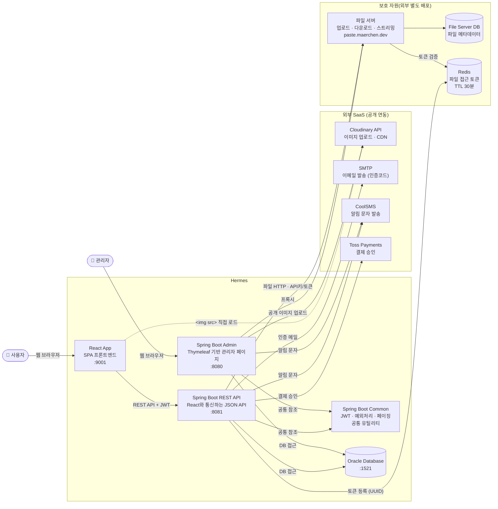
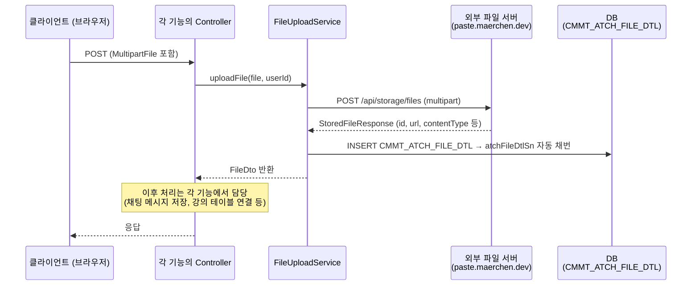

# Final Project - Backend

## 1. 프로젝트 구조

```text
backend
├── admin (관리자 모듈, 타임리프 + 스프링)
├── common (공통 모듈)
└── rest (REST API 모듈, React와 통신)
```

### 1-1. 관련 기술 스택

- **Spring Boot** — 웹 서버, Security, Validation, Mail
- **MyBatis** — SQL 매퍼 (Oracle DB)
- **JWT** (`jjwt`) — Access Token / Refresh Token
- **JavaMailSender** — 이메일 발송
- **Cloudinary** — 이미지 업로드
- **Lombok** — 보일러플레이트 코드 감소
- **dotenv-java** — `.env` 환경 변수 로딩

### 1-2. 패키지 룰

> [!IMPORTANT]
> 레이어로 먼저 나누고, 그 안에서 도메인별로 나눕니다.
>
> ```text
> common
> └── kr.or.ddit.finalProject
>    ├── dto
>    │   ├── user        ← 도메인별
>    │   └── auth
>    ├── service
>    │   ├── user
>    │   └── email
>    ├── exception
>    │   └── user
>    └── mapper
> ```

### 1-3. 요청/응답 구조



## 2. 프로젝트 실행

- 관리자 페이지 개발 시 admin 모듈을 실행

    ```bash
    cd admin
    ./mvnw spring-boot:run
    ```

- REST API 개발 시 rest 모듈을 실행

    ```bash
    cd rest
    ./mvnw spring-boot:run
    ```

- 공통 모듈(common)은 admin과 rest에서 모두 참조하므로, 별도의 실행이 필요하지 않음

## 3. 접근 주소

- 관리자 페이지: `http://localhost:8080`
- REST API: `http://localhost:8081`

## 4. 환경 변수 설정

> [!IMPORTANT]
>
> `.env.example` 파일을 복사하여 `.env` 파일을 생성한 후, 필요한 환경 변수를 설정합니다.
>
> ```bash
> # .env
>
> db_host=192.168.0.1
> db_username=foo
> db_password=bar
>
> smtp_username=example_smtp_username
> smtp_password=example_smtp_password
>
> email_sender=example_email_sender_address
>
> jwt_secret=example_jwt_secret_key
>
> cloudinary_api_key=example_cloudinary_api_key
> cloudinary_api_secret=example_cloudinary_api_secret_key
>
> kakao_pay_secret_key=example_kakao_pay_secret_key
> toss_pay_secret_key=example_toss_pay_secret_key
> ```

## 5. 유틸리티

### 5-1. [RandomSixDigits](common/src/main/java/kr/or/ddit/finalProject/util/RandomSixDigits.java) (common)

6자리 인증 코드를 생성하는 유틸리티 클래스입니다.
이메일 인증에 사용하며, `generate()` 메소드를 호출하면 000000부터 999999 사이의 랜덤한 6자리 숫자 문자열이 반환됩니다.

### 5-2. [TokenHashUtil](common/src/main/java/kr/or/ddit/finalProject/util/TokenHashUtil.java) (common)

토큰 해싱 유틸리티, HMAC-SHA256 알고리즘을 사용하여 토큰을 해싱하는 기능을 제공합니다.

### 5-3. [PrintPrettyObject](common/src/main/java/kr/or/ddit/finalProject/util/PrintPrettyObject.java) (common)

객체를 JSON 형태로 예쁘게 반환하는 유틸리티 클래스입니다.
디버깅이나 로깅 시 객체의 내용을 쉽게 확인할 수 있도록 도와줍니다.

## 6. 페이징 처리

[PaginationInfo.java](common/src/main/java/kr/or/ddit/finalProject/paging/PaginationInfo.java) (common)

위의 클래스는 페이징 처리를 위한 정보를 담고 있습니다.

아래와 같이 두 개의 생성자가 제공되며, 첫 번째 생성자는 기본적인 페이징 정보만을 설정하는 반면, 두 번째 생성자는 정렬 기준과 방향까지 포함하여 설정할 수 있습니다.

정렬과 관련된 필드인 `orderBy`와 `orderDirection`은 예를 들어, 회원 목록을 반환할 때 `mem_id`를 기준으로 오름차순으로 정렬하려면, `orderBy`에 "mem_id"를, `orderDirection`에 "ASC"를 설정하면 됩니다.

### 6-1. PaginationInfo 클래스의 생성자 예시

```java
/**
 * PaginationInfo 객체를 생성하는 생성자
 *
 * @param screenSize 한 페이지에 보여줄 데이터 수
 * @param blockSize  한 번에 보여줄 페이지 번호 수
 * @param page       현재 페이지 번호
 */
public PaginationInfo(int screenSize, int blockSize, int page) {
    this.screenSize = screenSize;
    this.blockSize = blockSize;
    this.page = page;
}

/**
 * PaginationInfo 객체를 생성하는 생성자 (정렬 기준과 방향을 포함)
 *
 * @param screenSize     한 페이지에 보여줄 데이터 수
 * @param blockSize      한 번에 보여줄 페이지 번호 수
 * @param page           현재 페이지 번호
 * @param orderBy        정렬 기준 컬럼명 (ex: mem_id, mem_name 등.. mapper에서 if 문으로 사용됨)
 * @param orderDirection 정렬 방향 (ASC(오름차순), DESC(내림차순))
 */
public PaginationInfo(int screenSize, int blockSize, int page, String orderBy, String orderDirection) {
    this.screenSize = screenSize;
    this.blockSize = blockSize;
    this.page = page;
    this.orderBy = orderBy;
    this.orderDirection = orderDirection;
}

```

### 6-2. MyBatis Mapper XML에서 정렬 기준과 방향, 페이징을 사용하는 예시

> [!WARNING]
>
> temp 패키지는 페이징 처리 테스트를 위한 임시 패키지입니다. 실제로는 도메인 객체와 관련된 패키지에서 사용해야 해요.

```xml
    <!-- 검색과 정렬을 할 수 있도록 조각을 정의 -->
    <sql id="detailConditionFragment">
        <trim prefix="where" prefixOverrides="and">
            <if test="detailCondition != null ">
                <if test="detailCondition.memName != null and detailCondition.memName != ''">
                    AND instr (m.mem_name, #{detailCondition.memName}) > 0
                </if>
                <if test="detailCondition.memAdd1 != null and detailCondition.memAdd1 != ''">
                    AND
                    ( instr (m.mem_add1, #{detailCondition.memAdd1}) > 0
                    OR instr (m.mem_add2, #{detailCondition.memAdd1}) > 0
                    )
                </if>
            </if>
        </trim>
    </sql>

    <sql id="orderFragment">
        <if test="orderBy != null and orderBy != ''">
            order by ${orderBy} ${orderDirection}
        </if>
    </sql>


    <!-- 페이징 처리를 위한 쿼리 -->
    <select id="selectMemberDtoForPagingTestList" resultType="kr.or.ddit.finalProject.paging.temp.MemberDtoForPagingTest">
        select * from (
            select mem_id, mem_name, mem_mail, mem_add1, mem_add2, mem_zip, mem_hp
            from member m
                <include refid="detailConditionFragment"/>
                <include refid="orderFragment"/>
        )
        offset #{offset} rows fetch next #{screenSize} rows only
    </select>

    <select id="getTotalMemberCount" resultType="int">
        SELECT COUNT(*) FROM MEMBER m
        <include refid="detailConditionFragment"/>
    </select>
```

## 7. 예외 처리

### 7-1. 커스텀 예외 클래스

[FinalProjectException.java](common/src/main/java/kr/or/ddit/finalProject/exception/FinalProjectException.java) (common)

위 클래스는 우리 프로젝트에서 발생할 수 있는 예외 상황을 나타내는 최상위 커스텀 예외 클래스입니다. 이 클래스를 상속하여 다양한 예외 상황에 대한 구체적인 예외 클래스를 정의할 수 있습니다.

상속 받아 정의할 클래스는 도메인 객체와 관련된 예외 상황만 정의하고,
구체적인 예외 상황에 대한 메시지는 ErrorCode ENUM에서 정의된 메시지를 사용하여 생성자에서 전달하는 방식으로 구현합니다.

```java
/**
 * 사용자 관련 예외를 처리하기 위한 커스텀 예외 클래스
 */
public class UserException extends FinalProjectException {
    public UserException(ErrorCode errorCode) {
        super(errorCode);
    }
    public UserException(ErrorCode errorCode, Throwable cause) {
        super(errorCode, cause);
    }
}

// 사용 예시 (예외 상황에 따라 적절한 에러 코드를 전달하여 예외 객체를 생성)
// 예를 들어, 사용자가 존재하지 않는 경우에 대한 예외 처리
throw new UserException(ErrorCode.USER_NOT_FOUND);

// ErrorCode.java 파일에서 USER_NOT_FOUND 에러 코드는 다음과 같이 정의되어 있습니다.
USER_NOT_FOUND(HttpStatus.NOT_FOUND, "사용자를 찾을 수 없습니다."),
```

### 7-2. 에러 코드 ENUM

[ErrorCode.java](common/src/main/java/kr/or/ddit/finalProject/exception/ErrorCode.java) (common)

위 ENUM에서 정의된 에러 코드는 우리 프로젝트에서 발생할 수 있는 다양한 예외 상황을 나타냅니다.

### 7-3. REST API 예외 처리 핸들러

[RestExceptionHandler.java](rest/src/main/java/kr/or/ddit/exception/RestExceptionHandler.java) (rest)

위 클래스는 REST API에서 발생하는 예외를 처리하는 핸들러입니다. `@RestControllerAdvice` 어노테이션을 사용하여 모든 REST 컨트롤러에서 발생하는 예외를 전역적으로 처리할 수 있습니다.

이 핸들러가 있어 컨트롤러 메소드에서 예외를 따로 처리하지 않고 어느 레이어에서든 예외를 던지면, 해당 예외가 이 핸들러로 전달되어 적절한 HTTP 상태 코드와 메시지를 포함한 일관된 응답이 반환됩니다.

> [!WARNING]
>
> 단, 이 핸들러는 Rest API 모듈에서만 그리고 FinalProjectException을 상속한 예외 클래스에 대해서만 적용됩니다.

## 8. JWT

Rest 모듈에서 JWT(Json Web Token)를 사용하여 보호 자원에 접근하는 클라이언트의 인증과 권한 부여를 처리합니다.

### 8-1. Access Token과 Refresh Token

우리 프로젝트에서는 JWT를 Access Token과 Refresh Token으로 나누어 사용합니다.

왜냐하면 API 요청은 Access Token으로 보호할 수 있지만,
페이지 접근 자체는 보호할 수 없습니다.

그리고 Access Token이 탈취되더라도 짧은 만료 시간으로 피해를 최소화하고,
Refresh Token을 HttpOnly Cookie에 격리해 XSS 공격으로부터 보호하기 위해 두 토큰을 나누어 사용합니다.

#### Access Token

- Access Token은 짧은 유효 기간을 가지며, 보호 자원에 접근할 때마다 클라이언트가 서버로 보내는 토큰입니다. Access Token은 React의 Context에 저장되어 보호 자원에 접근할 때마다 Authorization Header에 담아서 서버로 요청을 보냅니다.

#### Refresh Token

- Refresh Token은 Access Token보다 긴 유효 기간을 가지며, Access Token이 만료되었을 때 새로운 Access Token을 발급받기 위해 사용됩니다. Refresh Token은 HttpOnly Cookie에 저장되어 클라이언트에서 직접 접근할 수 없도록 합니다.

#### 흐름은 다음과 같습니다.

1. 로그인하면 서버가 Access Token(Body)과 Refresh Token(HttpOnly Cookie)을 발급합니다.

2. 이후 보호 자원 요청마다 Access Token을 `Authorization` 헤더에 담아 서버로 전송합니다.

3. 서버가 Access Token을 검증하고, 유효하면 요청을 허용합니다.

4. Access Token이 없거나 만료됐으면, `withCredentials: true` 옵션으로 HttpOnly Cookie의
   Refresh Token을 서버에 전송하여 새 Access Token을 재발급받습니다.

> 2~4번 로직은 axios 인터셉터와 React Auth Context Provider로 구현되어 있습니다.

### 8-2. 로그인

사용자가 로그인 할 때 `/api/auth/login` 엔드포인트로 로그인 요청을 보내면, 서버는 사용자의 자격 증명을 검증한 후 Access Token과 Refresh Token을 발급해 DB에 저장하고, Client로 전달합니다.

DB에 Refresh Token이 저장되어 있을 때 새로운 로그인 요청이 들어오면, 기존에 저장된 Refresh Token을 삭제하고 새로운 Refresh Token을 저장하여, 한 번에 하나의 Refresh Token만 유효하도록 합니다.

### 8-3. 로그아웃

사용자가 로그아웃 할 때 `/api/auth/logout` 엔드포인트로 로그아웃 요청을 보내면, 서버는 DB에 저장된 Refresh Token을 삭제하여 해당 Refresh Token이 더 이상 유효하지 않도록 합니다. 또한 Refresh Token 쿠키도 삭제하여 클라이언트에서 더 이상 Refresh Token에 접근할 수 없도록 합니다.

### 8-4. Access Token의 Body

Access Token의 Body에는 다음과 같은 정보가 담겨 있습니다.

```json
{
    "sub": "user123", // 사용자 ID
    "roles": ["ROLE_USER"], // 사용자 권한 정보
    "iat": 1620000000, // 토큰 발급 시간 (Unix timestamp)
    "exp": 1620003600 // 토큰 만료 시간 (Unix timestamp)
}
```

### 8-5. Refresh Token의 Body

Refresh Token의 Body에는 다음과 같은 정보가 담겨 있습니다.

```json
{
    "sub": "user123", // 사용자 ID
    "iat": 1620000000, // 토큰 발급 시간 (Unix timestamp)
    "exp": 1622592000 // 토큰 만료 시간 (Unix timestamp)
}
```

### 8-6. JWT 검증

Rest 서버 쪽으로 보호자원에 접근하는 요청이 들어오면, 서버는 Authorization Header에 담긴 Access Token을 검증하여 유효한 토큰인지 확인합니다.

JWT 토큰에 담긴 사용자의 정보를 검증하는 로직을 `JwtAuthenticationFilter`에 구현해 놓았습니다.

사용자의 정보를 사용해 DB에서 해당 사용자가 정말 존재하는지, 해당 사용자가 요청한 보호 자원에 접근할 권한이 있는지 등을 검증하여, 유효한 토큰이라면 해당 요청을 처리하도록 허용하고, 유효하지 않은 토큰이라면 적절한 에러 응답을 반환합니다.

## 9. Email

[EmailServiceImpl.java](common/src/main/java/kr/or/ddit/finalProject/service/email/EmailServiceImpl.java) (common)

위 클래스는 이메일 발송을 담당하는 서비스 클래스입니다. Spring의 `JavaMailSender`를 사용하여 이메일을 발송하는 기능을 구현하고 있습니다.

- `sendEmail` 메소드는 이메일 발송을 위한 메소드로, 이메일 수신자, 제목, 본문을 매개변수로 받아 이메일을 발송합니다.

```java
/**
 * 임의의 본문을 포함한 이메일을 전송하는 메서드
 *
 * @param to      이메일 수신자
 * @param subject 이메일 제목
 * @param body    이메일 본문
 * @return 발송 결과 메시지
 */
public String sendEmail(String to, String subject, String body);
```

- `sendEmailSixDigits` 메소드는 6자리 인증 코드를 생성하여 이메일로 발송하는 메소드입니다. 이 메소드는 회원가입이나 비밀번호 재설정과 같은 상황에서 사용될 수 있습니다.

```java
@Autowired
private JavaMailSender mailSender;

@Value("${email_sender}") // application.properties - .env 파일에서 email_sender 키로 이메일 발송자 주소를 설정
private String emailSender;

@Override
public String sendEmailSixDigits(String to) {
    String code = RandomSixDigits.generate();
    SimpleMailMessage message = new SimpleMailMessage();
    message.setFrom(emailSender);
    message.setTo(to);
    message.setSubject("Your 6-digit verification code");
    message.setText(code);
    mailSender.send(message);
    log.info("Email sent to {} with subject '{}'", to, "Your 6-digit verification code");
    return code;
}
```

## 10. File Upload

### 10-1. Admin 모듈 — FileUploadService

Admin 모듈의 파일 업로드는 공통 서비스인 `FileUploadService`를 통해 처리됩니다.
채팅 파일 전송, 강의 영상 업로드, 강의 첨부파일 등 파일이 필요한 모든 기능에서 공통으로 사용합니다.

관련 파일:

- 서비스: [FileUploadService.java](common/src/main/java/kr/or/ddit/finalProject/service/file/FileUploadService.java) (common)
- DB 저장 결과 DTO: [FileDto.java](common/src/main/java/kr/or/ddit/finalProject/dto/file/FileDto.java) (common)
- 파일 서버 응답 DTO: [StoredFileResponse.java](common/src/main/java/kr/or/ddit/finalProject/dto/file/StoredFileResponse.java) (common)
- DB 매퍼: [FileUploadMapper.java](common/src/main/java/kr/or/ddit/finalProject/mapper/FileUploadMapper.java) (common)

#### 지원 파일 형식

외부 파일 서버(`paste.maerchen.dev`)가 허용하는 형식입니다.

| 형식   | MIME 타입                                            |
| ------ | ---------------------------------------------------- |
| 이미지 | `image/jpeg`, `image/png`, `image/gif`, `image/webp` |
| PDF    | `application/pdf`                                    |
| 동영상 | `video/mp4`, `video/webm`, `video/ogg`               |
| ZIP    | `application/zip`, `application/x-zip-compressed`    |

> [!NOTE]
> 지원하지 않는 형식을 보내면 파일 서버가 `400 Bad Request`를 반환하며, 이는 `FILE_TYPE_NOT_SUPPORTED` 예외로 변환됩니다.
> 프론트엔드에서 사전에 MIME 타입을 검증하는 것을 권장합니다.

#### 업로드 흐름



#### Input / Output

**Input** — `FileUploadService.uploadFile(MultipartFile file, String userId)`

| 파라미터 | 설명                                                     |
| -------- | -------------------------------------------------------- |
| `file`   | 업로드할 파일 (`MultipartFile`)                          |
| `userId` | 업로드한 사용자 ID (`Authentication.getName()`으로 획득) |

**Output** — `FileDto`

| 필드            | DB 컬럼                 | 설명                                                             |
| --------------- | ----------------------- | ---------------------------------------------------------------- |
| `atchFileDtlSn` | `ATCH_FILE_DTL_SN` (PK) | DB 저장 후 시퀀스로 자동 채번. 다른 테이블과 JOIN할 때 FK로 사용 |
| `orgnFileNm`    | `ORGN_FILE_NM`          | 원본 파일명                                                      |
| `savePathNm`    | `SAVE_PATH_NM`          | 파일 서버 접근 URL (= `viewUrl`)                                 |
| `saveFileNm`    | `SAVE_FILE_NM`          | 파일 서버 URL (= `url`)                                          |
| `fileExtNm`     | `FILE_EXT_NM`           | MIME 타입 (예: `image/png`) — 확장자가 아님에 주의               |
| `fileSizeCnt`   | `FILE_SIZE_CNT`         | 파일 크기 (bytes)                                                |
| `rgtrId`        | `RGTR_ID`               | 업로드한 사용자 ID                                               |

> [!IMPORTANT]
> `fileExtNm` 필드명이 '확장자'처럼 보이지만 실제로는 **MIME 타입** 문자열이 저장됩니다.
> 이미지 여부 판별 시 `fileExtNm.startsWith("image/")` 를 사용하세요.

#### 기본 사용 예시

```java
@PostMapping("/some/upload")
public ResponseEntity<?> upload(@RequestParam MultipartFile file, Authentication authentication) {
    String userId = authentication.getName();
    FileDto fileDto = fileUploadService.uploadFile(file, userId);

    // 이후 각 기능에 맞게 FileDto를 활용
    // fileDto.getAtchFileDtlSn() → 다른 테이블의 FK로 저장
    // fileDto.getSavePathNm()    → 파일 접근 URL
    // fileDto.getOrgnFileNm()    → 원본 파일명
    // fileDto.getFileExtNm()     → MIME 타입 (image/* 여부 판별 등)
    ...
}
```

#### 예외

`FileUploadService.uploadFile()` 에서 발생할 수 있는 예외입니다.
호출하는 컨트롤러에서 `@ExceptionHandler`로 처리하거나, `@ControllerAdvice`를 통해 전역 처리할 수 있습니다.

| 예외 상황               | `ErrorCode`               | HTTP 상태 |
| ----------------------- | ------------------------- | --------- |
| 파일이 비어있음         | `FILE_EMPTY`              | 400       |
| 지원하지 않는 파일 형식 | `FILE_TYPE_NOT_SUPPORTED` | 400       |
| 파일 서버 업로드 실패   | `FILE_UPLOAD_FAILED`      | 500       |
| DB 저장 실패            | `FILE_INFO_SAVE_FAILED`   | 500       |

#### 적용 사례 — 채팅 파일 전송

채팅에서는 업로드된 파일을 WebSocket으로 브로드캐스트하는 추가 처리가 있습니다.
`FileDto`의 MIME 타입(`fileExtNm`)으로 채팅 메시지 타입(`msgTypeCd`)을 결정합니다.

| `msgTypeCd` | 조건                             | 채팅 표시 방식         |
| ----------- | -------------------------------- | ---------------------- |
| `02`        | `fileExtNm.startsWith("image/")` | 인라인 이미지 미리보기 |
| `03`        | 그 외 (PDF, 동영상, ZIP 등)      | 파일 다운로드 링크     |

```java
// ChatMessageController.uploadFile() 요약
FileDto fileDto = fileUploadService.uploadFile(file, userId);

String msgTypeCd = fileDto.getFileExtNm() != null
        && fileDto.getFileExtNm().startsWith("image/") ? "02" : "03";

MessageContentDto msg = MessageContentDto.builder()
        .msgTypeCd(msgTypeCd)
        .msgCn(fileDto.getSavePathNm())                        // 파일 접근 URL
        .atchFileId(String.valueOf(fileDto.getAtchFileDtlSn())) // JOIN 키
        .build();

chatService.sendMessage(msg);                 // DB 저장
msg.setFileNm(fileDto.getOrgnFileNm());       // WS 브로드캐스트용 (DB 미매핑)
messagingTemplate.convertAndSend("/topic/messages/" + roomSn, msg);
```

### 10-2. Rest 모듈

Rest 모듈에서의 파일 업로드는
Cloudinary API를 사용하여 구현합니다.

## 11. 결제

### 11-1. Kakao Pay API

[KakaoPayService.java](common/src/main/java/kr/or/ddit/finalProject/service/pay/KakaoPayService.java) (common)

위 서비스는 Kakao Pay API를 사용하여 결제 요청을 처리하는 서비스 클래스입니다.

#### 1. 결제 준비 요청

클라이언트 측에서 보낸 상품명, 금액, 수량(`KakaoPayReadyRequest` DTO로 매핑된)과 `Authentication`을 KakaoPayService의 `payReady()` 메소드로 넘기면

Kakao Pay API에 결제 준비 요청을 보내고, 결제 준비가 완료되면 Kakao Pay에서 반환된 결제 승인 URL을 반환합니다.

```java
// Rest 컨트롤러에서 결제 준비 요청을 처리하는 예시
@PostMapping("/test/kakao-pay")
public ResponseEntity<KakaoPayReadyResponse> kakaoPayTest(
        @RequestBody KakaoPayReadyRequest formData, Authentication authentication) {

    log.info("Received Kakao Pay request: {}", formData);

    KakaoPayReadyResponse response = kakaoPayService.payReady(formData, authentication);

    return ResponseEntity.ok(response);
}
```

#### 2. 결제 승인 요청

사용자가 Kakao Pay 결제 승인 페이지에서 결제를 진행하여 정상적으로 결제가 완료되면, Kakao Pay에서 결제 승인 요청이 `/test/kakao-pay/success/{uuid}` (임의로 설정한 엔드포인트) 엔드포인트로 pg_token과 함께 들어오게 됩니다.
그러면 컨트롤러에서 KakaoPayService의 `approvePayment()` 메소드를 호출하여 결제 승인을 처리합니다.

```java
// Rest 컨트롤러에서 결제 승인 요청을 처리하는 예시
@GetMapping("/test/kakao-pay/success/{uuid}")
public ResponseEntity<KakaoPayApproveResponse> getMethodName(@PathVariable("uuid") String uuid,
        @RequestParam("pg_token") String pgToken) {

    KakaoPayApproveResponse response = kakaoPayService.approvePayment(pgToken, uuid);
    log.info("Kakao Pay approval response: {}", response);

    return ResponseEntity.ok(response);
}
```

#### 3. 현재 문제점과 향후 개선 방향

- 현재는 결제 준비 요청과 결제 승인 요청이 테스트용 엔드포인트로 구현되어 있습니다. 실제 서비스에서는 상품 주문과 결제 처리를 연동하여 구현해야 합니다.
- 결제 승인 후, 주문 상태를 업데이트하거나, 결제 정보를 DB에 저장하는 로직이 추가로 필요합니다. (지금은 ConcurrentHashMap에 임시로 저장하고 있습니다.)
- 결제 실패나 취소에 대한 처리도 구현해야 합니다.

### 11-2. Toss Payments API

[TossPayService.java](common/src/main/java/kr/or/ddit/finalProject/service/pay/TossPayService.java) (common)

위 서비스는 Toss Payments API를 사용하여 결제 요청을 처리하는 서비스 클래스입니다.

프론트는 일단 임시로 아래와 같이 구현해 놓았습니다. 실제 서비스에서는 상품 주문과 결제 처리를 연동하여 구현해야 합니다.

`TossPayTestPage.tsx`

```ts
// 결제 요청을 보내는 페이지
import { loadTossPayments, ANONYMOUS } from "@tosspayments/tosspayments-sdk";
import type { TossPayRequestInterface } from "../../../types/TossPayRequestInterface";
import { useSearchParams } from "react-router-dom";

const clientKey = "test_ck_ALnQvDd2VJ209bO49mMOVMj7X41m";

export default function TossPayTestPage() {
  const [searchParams] = useSearchParams();
  const handlePayment = async () => {
    const tossPayments = await loadTossPayments(clientKey);
    const payment = tossPayments.payment({ customerKey: ANONYMOUS });

    const req: TossPayRequestInterface = {
      amount: {
        currency: "KRW",
        value: searchParams.get("total_amount")
          ? parseInt(searchParams.get("total_amount")!)
          : 100,
      },
      orderId: crypto.randomUUID(),
      orderName: searchParams.get("item_name") || "테스트 상품",
      successUrl: "http://localhost:9001/test/toss-pay/success",
      failUrl: "http://localhost:9001/test/toss-pay/fail",
    };

    await payment.requestPayment({
      method: "CARD",
      ...req,
    });
  };
  handlePayment();

  return <div></div>;
}
```

위 코드에서 tossPayments.payment() 메소드를 호출하여 결제 객체를 생성하고, requestPayment() 메소드를 호출하여 결제 요청을 보냅니다.

결제 요청에는 결제 수단(method)과 결제 정보(req)가 포함됩니다.

결제가 완료되면, successUrl로 리디렉션되고, 결제가 실패하면 failUrl로 리디렉션됩니다.

`TossPaySuccessTestPage.tsx`

```ts
// 결제 성공 후 리디렉션되는 페이지

import { useEffect } from "react";
import { useSearchParams } from "react-router-dom";
import api from "../../../api/api";

export default function TossPaySuccessTestPage() {
  const [searchParams] = useSearchParams();

  useEffect(() => {
    const confirm = async () => {
      const paymentKey = searchParams.get("paymentKey");
      const orderId = searchParams.get("orderId");
      const amount = searchParams.get("amount");
      const productName = searchParams.get("orderName");

      const res = await api.post("/api/payments/confirm", {
        paymentKey,
        orderId,
        amount,
        productName,
      });
      alert(
        `결제 성공! 결제 ID: ${res.data.orderId} / 상품명: ${res.data.orderName} / 결제 금액: ${res.data.totalAmount} ${res.data.currency}`,
      );
      window.close();
    };

    confirm();
  }, [searchParams]);

  return (
    <div>
      <p>결제 처리중...</p>
    </div>
  );
}

```

위 코드에서 결제 성공 후 리디렉션되는 페이지에서는 URL에 포함된 결제 정보를 추출하여 서버의 `/api/payments/confirm` 엔드포인트로 결제 확인 요청을 보냅니다.

서버에서는 TossPayService의 `confirm()` 메소드를 호출하여 결제 확인을 처리하고, 결제 결과를 클라이언트로 반환합니다.

```java
// Rest 컨트롤러에서 결제 확인 요청을 처리하는 예시
@PostMapping("/payments/confirm")
public ResponseEntity<?> confirmPayment(@RequestBody TossPayRequest request,
                                        Authentication authentication) {
    log.info("Received Toss Pay confirm request: {}, {}, {}, {}", request.getAmount(),
            request.getOrderId(), request.getPaymentKey(), authentication.getPrincipal());

    return ResponseEntity.ok(tossPayService.confirm(request));
}
```

#### 현재 문제점과 향후 개선 방향

- 결제 승인 후, 주문 상태를 업데이트하거나, 결제 정보를 DB에 저장하는 로직이 추가로 필요합니다.
- 결제 실패나 취소에 대한 처리도 구현해야 합니다.

### 11-3. 비고

#### 1. Kakao Pay 결제 승인 응답

```json
{
    "cid": "TC0ONETIME",
    "aid": "Aa0c10ad26bf7fb41c8f",
    "tid": "Ta0c109f57126faa1c72",
    "sid": null,
    "partner_order_id": "order123",
    "partner_user_id": "testuser02",
    "payment_method_type": "MONEY",
    "amount": {
        "total": 60000,
        "tax_free": 0,
        "vat": 5455,
        "point": 0,
        "discount": 0,
        "green_deposit": 0
    },
    "card_info": null,
    "item_name": "춘식이",
    "item_code": null,
    "quantity": 10,
    "created_at": "2026-05-19T16:26:24",
    "approved_at": "2026-05-19T16:26:37",
    "payload": null
}
```

#### 2. Toss 결제 완료 응답

```json
{
    "lastTransactionKey": "txrd_a01krzd9wmazk2jpb29z857z8am",
    "paymentKey": "tviva20260519150253o97N9",
    "orderId": "8ac1e1ad-b064-41d9-89b6-7e936c23cf58",
    "orderName": "춘식이",
    "taxExemptionAmount": 0,
    "status": "DONE",
    "requestedAt": "2026-05-19T15:02:53+09:00",
    "approvedAt": "2026-05-19T15:03:23+09:00",
    "useEscrow": false,
    "cultureExpense": false,
    "card": null,
    "virtualAccount": null,
    "transfer": null,
    "mobilePhone": null,
    "giftCertificate": null,
    "cashReceipt": null,
    "cashReceipts": null,
    "discount": null,
    "cancels": null,
    "secret": "ps_XZYkKL4MrjGqaqbe5GL80zJwlEWR",
    "type": "NORMAL",
    "easyPay": {
        "provider": "카카오페이",
        "amount": 10000,
        "discountAmount": 0
    },
    "country": "KR",
    "failure": null,
    "receipt": {
        "url": "https://dashboard-sandbox.tosspayments.com/receipt/redirection?transactionId=tviva20260519150253o97N9&ref=PX"
    },
    "checkout": {
        "url": "https://api.tosspayments.com/v1/payments/tviva20260519150253o97N9/checkout"
    },
    "currency": "KRW",
    "totalAmount": 10000,
    "balanceAmount": 10000,
    "suppliedAmount": 9091,
    "vat": 909,
    "taxFreeAmount": 0,
    "method": "간편결제",
    "version": "2024-06-01",
    "metadata": null,
    "mid": null,
    "partialCancelable": false
}
```
